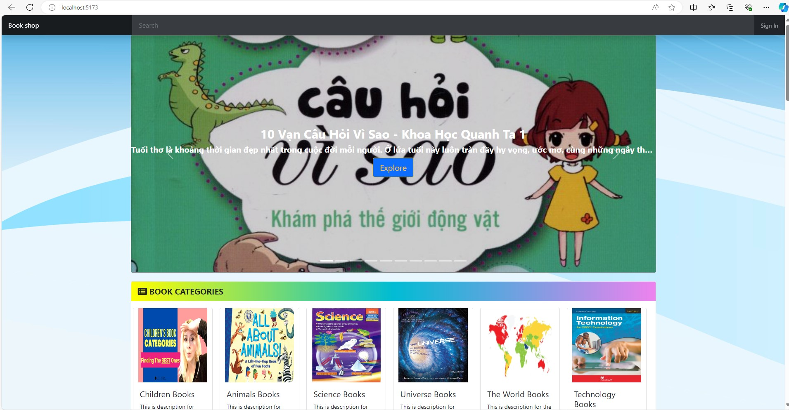

# BOOK SHOP
A practical pet project that uses FastAPI as backend and React as frontend

## Build Status

[](https://codecov.io/gh/sieunhantanbao/book-shop)

[](https://sonarcloud.io/summary/new_code?id=sieunhantanbao_book-shop)
[](https://sonarcloud.io/summary/new_code?id=sieunhantanbao_book-shop)
[](https://sonarcloud.io/summary/new_code?id=sieunhantanbao_book-shop)
[](https://sonarcloud.io/summary/new_code?id=sieunhantanbao_book-shop)
[](https://sonarcloud.io/summary/new_code?id=sieunhantanbao_book-shop)
[](https://sonarcloud.io/summary/new_code?id=sieunhantanbao_book-shop)
[](https://sonarcloud.io/summary/new_code?id=sieunhantanbao_book-shop)
[](https://sonarcloud.io/summary/new_code?id=sieunhantanbao_book-shop)
[](https://sonarcloud.io/summary/new_code?id=sieunhantanbao_book-shop)

[](https://sonarcloud.io/summary/new_code?id=sieunhantanbao_book-shop)

## Technical stacks
- [Python](https://www.python.org/)
- [FastAPI](https://fastapi.tiangolo.com/)
- [React](https://react.dev/)
- [PostgreSQL](https://www.postgresql.org/)
- [Redis](https://redis.io/downloads/)
- [Taskfile](https://taskfile.dev/)
- [Docker](https://www.docker.com/)
- [Docker Compose](https://docs.docker.com/compose/)

## How to run?
### With Taskfile
#### This method requires the [PostgreSQL](https://www.postgresql.org/), [Redis](https://redis.io/downloads/), and [Python](https://www.python.org/) to be installed already.

⚙️ Update the environments settings
- Rename the sample.env file to .env and update the settings
```bash
   APP_SECRET_KEY='myrandomuntellsecret' # You can change to any other value if needed
   REDIS_HOST='localhost' # Update with your installed redis host
   REDIS_PORT=6379 # Update with your installed redis port
   REDIS_PASSWORD=redis # Update with your installed redis password (leave blank if it does not have password)
   UPLOAD_FOLDER='app/static/files_uploaded'
   ALLOWED_EXTENSIONS={'pdf', 'png', 'jpg', 'jpeg', 'gif'}
   DB_ENGINE=postgresql
   DB_HOST='localhost' # Update with your installed Postgresql host
   DB_USERNAME=postgres # Update with your installed Postgresql username
   DB_PASSWORD=postgres # Update with your installed Postgresql password
   DB_PORT=5432 # Update with your installed Postgresql port
   DB_NAME='book_shop_develop_db' # You can change to any other value if needed
   DEFAULT_ADMIN_PASSWORD=12345678 # You can change to any other value if needed
   JWT_SECRET=MIIBIjANBgkqhkiG9w0BAQEFAAOCAQ8AMIIBCgKCAQEA2i/bL8RBDeq6tKOdgaP0mNYpiUZIHT2QZjc8wZgvZEqQx4avnkujE92emGS1p6b6/y229oNj+vkSKXCMHJ3FUG3ytFfDNSDMMqp1gLq2n0oRJT8KKHfBApf/v/BK5aYGD9sKZ/FSEapXN79nwBywabQPpa5jpcFjLQD3cg8ezLWPfnyVS76i3mHpVWwPUABHqT4DFaz0PDXtZa2TAIYf7tMa3NNcWHA9OgRtfIbTqkimUdy6aW3w0GGav1KPdfxNMQ0m7+cOE9uc8yYR0DavyFe8b3Tz1xUKV2oKNfnyRkOWasHYTI9PZUwnnHWCa74X5LI6xJZ9myVecq/YDXw9qQIDAQAB # You can change to any other value if needed
   JWT_ALGORITHM=HS256
   ALLOWED_ORIGINS='http://localhost:5173' # The front-end (React) URL
```
⚙️ Run the application
- Create virtual environment

For Window
```bash
cd src/service
py -3 -m venv .venv
.venv\Scripts\activate
cd ../..
```

For Linux/MacOS
```bash
cd src/service
python3 -m venv .venv
. .venv/bin/activate
cd ../..
```

- Run data migration
```bash
task run-migration
```

- Init the application
```bash
task init-backend
task init-frontend
```

- Run the application. Note: you may need to install the [concurrently](https://www.npmjs.com/package/concurrently) if not install it yet
```bash
task run-all
```

### With Docker Compose
⚙️ Update the environments settings (refer the above)

👉 Direct Docker Compose
```bash
docker compose up -d --build
```

👉 Or run Docker Compose via Taskfile
```bash
task dc-build-up
```
### With K8S (minikube)
👉 [Run with Minikube](/k8s/README.md)

## Access the website

```bash
http://localhost:5173
```
You can register a new account and login or use the initial credential `(nguyensieuanh@gmail.com/12345678)`. Note that the password should get from the .env (DEFAULT_ADMIN_PASSWORD).

